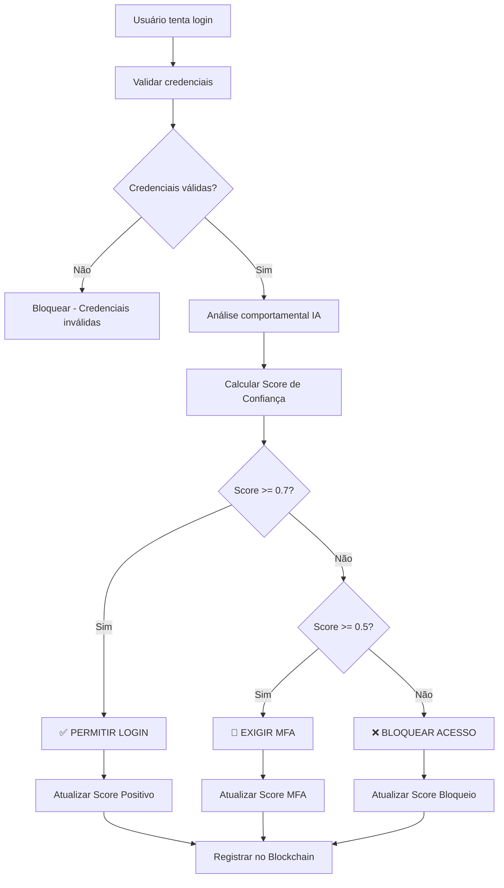

# 🎯 Guia Completo - Sistema de Score de Confiança

## 📋 Visão Geral

O Sistema de Score de Confiança é uma implementação avançada que combina **autenticação tradicional** (login/senha) com **análise comportamental inteligente** baseada em IA. O sistema calcula um score de confiança para cada usuário e toma decisões automáticas sobre permitir acesso, exigir autenticação de dois fatores (MFA) ou bloquear completamente.

## 🏗️ Arquitetura do Sistema

### Componentes Principais

```
┌─────────────────────────────────────────────────────────────┐
│                     SISTEMA DE SCORE DE CONFIANÇA          │
├─────────────────────────────────────────────────────────────┤
│  ┌─────────────────┐  ┌─────────────────┐  ┌──────────────┐ │
│  │  AUTENTICAÇÃO   │  │   ANÁLISE IA    │  │    SCORE     │ │
│  │   TRADICIONAL   │→ │  COMPORTAMENTAL │→ │  CONFIANÇA   │ │
│  └─────────────────┘  └─────────────────┘  └──────────────┘ │
│           │                      │                  │       │
│           ▼                      ▼                  ▼       │
│  ┌─────────────────┐  ┌─────────────────┐  ┌──────────────┐ │
│  │     LOGIN/      │  │ 3 ALGORITMOS ML │  │   DECISÃO    │ │
│  │     SENHA       │  │ 14 FEATURES     │  │ AUTOMÁTICA   │ │
│  └─────────────────┘  └─────────────────┘  └──────────────┘ │
│                                                   │         │
│                                                   ▼         │
│                           ┌─────────────────────────────────┤
│                           │ PERMITIR │ EXIGIR MFA │ BLOQUEAR│
│                           └─────────────────────────────────┤
└─────────────────────────────────────────────────────────────┘
```

## 🔢 Cálculo do Score de Confiança

### Fórmula Ponderada

O score final é calculado usando pesos específicos para cada componente:

```
Score Final = (Histórico × 0.4) + (IA × 0.3) + (Recente × 0.2) + (Externos × 0.1)
```

### Componentes Detalhados

#### 1. Histórico de Sucesso (40%)
- **Base**: Taxa de sucessos nos últimos 90 dias
- **Cálculo**: `sucessos / total_tentativas`
- **Penalização**: Redução por falhas (`falhas × 0.02`)
- **Exemplo**: 95% sucesso = 0.95 - (5 falhas × 0.02) = 0.85

#### 2. Análise de IA (30%)
- **Base**: Inversão do score de anomalia
- **Cálculo**: `1.0 - score_anomalia`
- **Fonte**: Ensemble de 3 algoritmos ML
- **Exemplo**: Anomalia 0.2 = Confiança 0.8

#### 3. Comportamento Recente (20%)
- **Período**: Últimos 7 dias
- **Fatores**: Consistência de IPs e dispositivos
- **Cálculo**: `1.0 - variação_normalizada`
- **Exemplo**: 2 IPs diferentes = Penalização 0.1

#### 4. Fatores Externos (10%)
- **Atividade**: Tempo desde último login
- **Verificação**: Conta verificada (+0.1)
- **Inatividade**: Mais de 1 semana (-0.2)

## 📊 Níveis de Confiança

### Classificação Automática

| Score | Nível | Cor | Descrição | Ação Padrão |
|-------|-------|-----|-----------|-------------|
| 0.8-1.0 | `MUITO_ALTO` | 🟢 | Usuário altamente confiável | Permitir |
| 0.6-0.8 | `ALTO` | 🟡 | Usuário confiável | Permitir |
| 0.4-0.6 | `MEDIO` | 🟠 | Usuário neutro | Permitir/MFA |
| 0.2-0.4 | `BAIXO` | 🔴 | Usuário suspeito | Exigir MFA |
| 0.0-0.2 | `MUITO_BAIXO` | ⚫ | Usuário de alto risco | Bloquear |

### Thresholds de Decisão

```java
// Configurações padrão
private static final double THRESHOLD_CONFIAVEL = 0.7;
private static final double THRESHOLD_MFA = 0.5;
private static final double THRESHOLD_BLOQUEIO = 0.2;
```

## 🔄 Fluxo de Autenticação

### Processo Completo



### Tipos de Evento

```java
public enum TipoEventoLogin {
    SUCESSO_NORMAL,     // Score alto, login direto
    SUCESSO_SUSPEITO,   // Score médio, login com monitoramento
    BLOQUEADO,          // Score baixo, acesso negado
    MFA_EXIGIDO         // Score médio-baixo, MFA necessário
}
```

## 🛠️ Implementação Técnica

### Entidade Principal

```java
@Entity
@Table(name = "scores_confianca")
public class ScoreConfianca {
    private Long id;
    private Usuario usuario;
    private Double scoreAtual;          // Score atual (0.0-1.0)
    private Double scoreBase;           // Score base histórico
    private Double fatorAjuste;         // Ajustes manuais
    private Integer totalLoginsSucesso; // Contador sucessos
    private Integer totalBloqueios;     // Contador bloqueios
    private Boolean emObservacao;       // Flag observação
    private LocalDateTime observacaoAte; // Fim da observação
    private NivelConfianca nivelConfianca; // Nível calculado
}
```

### Serviço Principal

```java
@Service
public class ServicoScoreConfianca {
    
    // Calcular score completo
    public ScoreConfianca calcularScore(Usuario usuario, PerfilComportamentalIA perfilIA);
    
    // Atualizar após login
    public ScoreConfianca atualizarAposLogin(Usuario usuario, TipoEventoLogin tipo, PerfilComportamentalIA perfil);
    
    // Determinar decisão
    public DecisaoAutenticacao determinarDecisao(ScoreConfianca score, PerfilComportamentalIA perfil);
    
    // Ajustar manualmente
    public ScoreConfianca ajustarScore(Usuario usuario, double ajuste, String motivo);
}
```

## 📡 APIs Disponíveis

### Endpoints de Consulta

#### 1. Consultar Score de Usuário
```http
GET /api/trust-score/usuario/{email}
```

**Resposta:**
```json
{
  "usuario": "user@example.com",
  "scoreAtual": 0.85,
  "nivelConfianca": "ALTO",
  "scoreBase": 0.80,
  "fatorAjuste": 0.05,
  "emObservacao": false,
  "ultimaAtualizacao": "2024-01-15T10:30:00",
  "motivoAlteracao": "Histórico: 0.800, IA: 0.750, Recente: 0.900, Externos: 0.600",
  "estatisticas": {
    "totalLoginsSucesso": 45,
    "totalLoginsSuspeitos": 2,
    "totalBloqueios": 0,
    "totalMfaExigido": 3
  },
  "decisoes": {
    "confiavel": true,
    "requerMfa": false,
    "deveBloquear": false
  }
}
```

#### 2. Simular Decisão
```http
GET /api/trust-score/decisao/{email}
```

**Resposta:**
```json
{
  "usuario": "user@example.com",
  "scoreAtual": 0.85,
  "nivelConfianca": "ALTO",
  "decisaoSimulada": "PERMITIR",
  "observacoes": {
    "confiavel": true,
    "requerMfa": false,
    "deveBloquear": false,
    "emObservacao": false
  }
}
```

### Endpoints de Administração

#### 3. Ajustar Score Manualmente
```http
POST /api/trust-score/ajustar/{email}?ajuste=0.2&motivo=Verificação manual
```

#### 4. Estatísticas Gerais
```http
GET /api/trust-score/estatisticas
```

**Resposta:**
```json
{
  "scoreMedioGeral": 0.72,
  "distribuicaoNiveis": {
    "MUITO_ALTO": 15,
    "ALTO": 32,
    "MEDIO": 28,
    "BAIXO": 8,
    "MUITO_BAIXO": 2
  },
  "totalUsuariosConfiaveis": 47,
  "usuariosScoreBaixo": 10,
  "usuariosEmObservacao": 3
}
```

#### 5. Listar por Nível
```http
GET /api/trust-score/nivel/{nivel}
```

Níveis disponíveis: `MUITO_BAIXO`, `BAIXO`, `MEDIO`, `ALTO`, `MUITO_ALTO`

## 🔧 Configuração e Personalização

### Thresholds Personalizáveis

```java
// Configurar thresholds no application.yml
trust-score:
  thresholds:
    confiavel: 0.7    # Acima deste valor = login direto
    mfa: 0.5          # Acima deste valor = MFA
    bloqueio: 0.2     # Abaixo deste valor = bloquear
  
  weights:
    historico: 0.4    # Peso do histórico
    ia: 0.3           # Peso da análise IA
    recente: 0.2      # Peso comportamento recente
    externos: 0.1     # Peso fatores externos
```

### Observação Temporária

```java
// Usuários bloqueados ficam em observação
score.setEmObservacao(true);
score.setObservacaoAte(LocalDateTime.now().plusHours(24));

// Durante observação, score é penalizado
if (Boolean.TRUE.equals(score.getEmObservacao())) {
    scoreCalculado *= 0.8; // Reduz 20%
}
```

## 📈 Monitoramento e Análise

### Métricas Importantes

1. **Score Médio Geral**: Indica saúde geral do sistema
2. **Distribuição por Níveis**: Mostra perfil dos usuários
3. **Taxa de Bloqueios**: Eficácia da detecção de riscos
4. **Usuários em Observação**: Monitoramento de suspeitos

### Alertas Recomendados

- Score médio abaixo de 0.6 (possível ataque)
- Muitos usuários em observação (problema sistêmico)
- Picos de bloqueios (tentativas de invasão)

## 🧪 Testes e Validação

### Script de Teste Automatizado

```bash
# Executar teste completo
./test-trust-score.ps1
```

### Casos de Teste Cobertos

1. **Criação de Score Inicial** (0.5 neutro)
2. **Evolução Positiva** (múltiplos logins bem-sucedidos)
3. **Ajuste Manual** (aumento e diminuição)
4. **Exigência de MFA** (score médio-baixo)
5. **Bloqueio Automático** (score muito baixo)
6. **Observação Temporária** (usuários suspeitos)
7. **Limpeza Automática** (observações expiradas)

### Validação de Integração

```http
# Teste de login com score
POST /auth/login
{
  "email": "test@example.com",
  "password": "senha123",
  "ipAddress": "192.168.1.100",
  "userAgent": "Mozilla/5.0...",
  "location": "São Paulo, SP"
}

# Resposta inclui score
{
  "token": "eyJhbGciOiJIUzI1NiJ9...",
  "nome": "Usuario Teste",
  "login": "test@example.com",
  "trustScore": 0.85,
  "trustLevel": "ALTO",
  "requiresMfa": false
}
```

## 🚀 Casos de Uso Práticos

### 1. Usuário Confiável (Score 0.85)
- **Comportamento**: Logins regulares, mesmo IP/dispositivo
- **Decisão**: Login direto sem MFA
- **Ação**: Continuar monitoramento passivo

### 2. Usuário Suspeito (Score 0.45)
- **Comportamento**: IP diferente, horário incomum
- **Decisão**: Exigir MFA
- **Ação**: Aumentar monitoramento, solicitar verificação adicional

### 3. Usuário de Alto Risco (Score 0.15)
- **Comportamento**: Múltiplos IPs, dispositivos desconhecidos
- **Decisão**: Bloquear acesso
- **Ação**: Colocar em observação, investigar atividade

### 4. Ajuste Manual (Administrador)
- **Situação**: Falso positivo confirmado
- **Ação**: Ajustar score +0.3 com motivo "Verificação manual"
- **Resultado**: Usuário volta ao nível confiável

## 🔒 Segurança e Auditoria

### Logs de Auditoria

Todas as operações são registradas:
- Cálculos de score com detalhamento
- Decisões tomadas automaticamente
- Ajustes manuais com justificativa
- Mudanças de nível de confiança

### Integração com Blockchain

```java
// Registro imutável de decisões
blockchainService.recordAuthenticationEvent(
    usuario, "LOGIN_DENIED_TRUST_SCORE", "DENIED", 
    scoreConfianca.getScoreAtual(),
    ipAddress, location, deviceFingerprint
);
```

## 📚 Próximos Passos

### Melhorias Planejadas

1. **Machine Learning Avançado**
   - Retreinamento automático dos modelos
   - Feedback loop para melhoria contínua
   - Detecção de novos padrões de ataque

2. **MFA Inteligente**
   - Implementação completa do 2FA
   - Múltiplos métodos (SMS, app, biometria)
   - MFA adaptativo baseado no contexto

3. **Análise Comportamental Avançada**
   - Padrões de navegação
   - Velocidade de digitação
   - Movimento do mouse

4. **Dashboard Administrativo**
   - Interface web para monitoramento
   - Relatórios em tempo real
   - Alertas automáticos

---

## 🎯 Resumo Executivo

O Sistema de Score de Confiança representa uma evolução significativa na segurança de autenticação, combinando:

- ✅ **Autenticação Tradicional** robusta
- ✅ **Análise Comportamental** com IA
- ✅ **Decisões Automáticas** baseadas em risco
- ✅ **Monitoramento Contínuo** de usuários
- ✅ **Flexibilidade Administrativa** para ajustes
- ✅ **Auditoria Completa** de todas as operações

Este sistema oferece uma camada adicional de proteção sem comprometer a experiência do usuário, permitindo que usuários confiáveis tenham acesso facilitado enquanto identifica e mitiga automaticamente tentativas de acesso suspeitas ou maliciosas.

---

**Sistema implementado e funcionando! 🚀** 