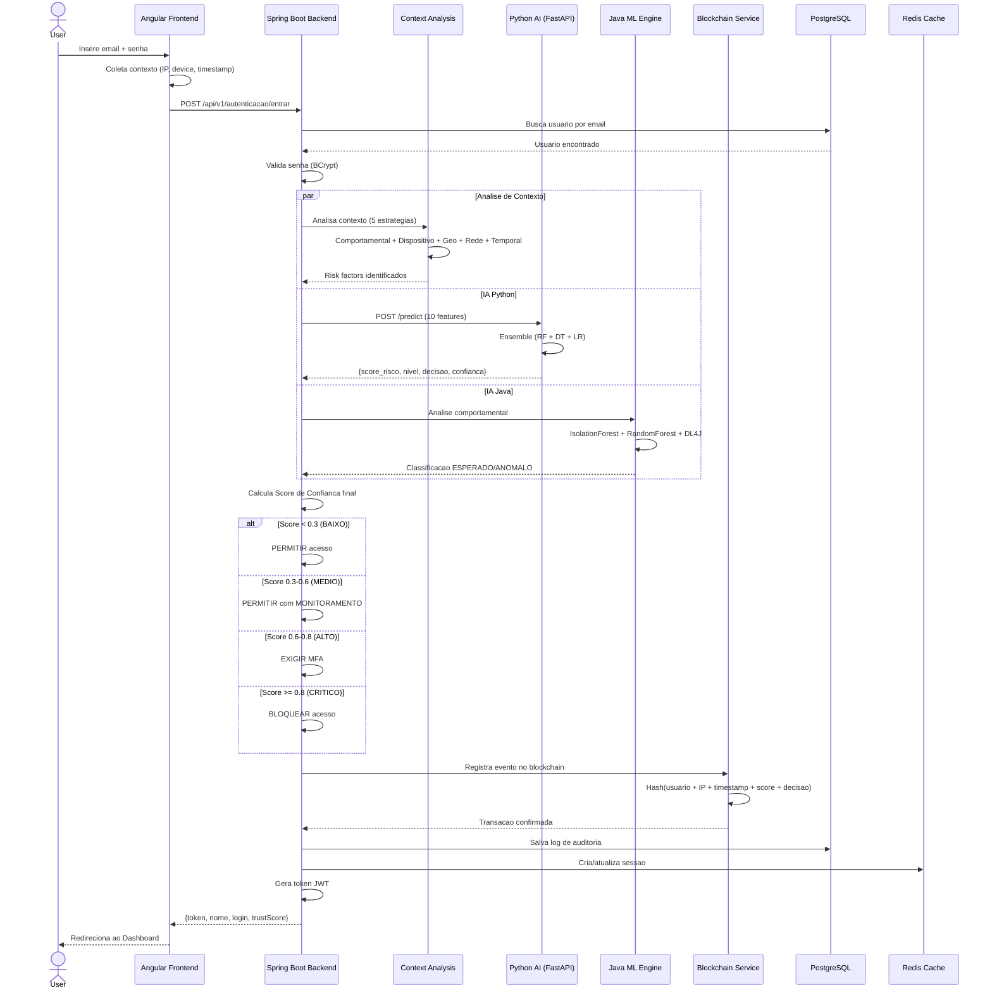

# Big Picture — Sistema Autonomo de Autenticacao Contextual com Blockchain e IA

## 1. Visao Geral da Arquitetura

```
┌─────────────────────────────────────────────────────────────────────────────────┐
│                          SISTEMA DE AUTENTICACAO INTELIGENTE                    │
│                    Autenticacao Contextual + IA + Blockchain                    │
├─────────────────────────────────────────────────────────────────────────────────┤
│                                                                                 │
│   ┌──────────┐    ┌──────────────────┐    ┌──────────────────┐                 │
│   │  USUARIO  │───>│  ANGULAR 17 SPA  │───>│  SPRING BOOT 3   │                │
│   │           │    │   (Port 4200)    │    │   (Port 8081)    │                 │
│   └──────────┘    └──────────────────┘    └────────┬─────────┘                 │
│                                                     │                           │
│                    ┌────────────────┬───────────────┼───────────────┐           │
│                    │                │               │               │           │
│              ┌─────▼─────┐  ┌──────▼──────┐ ┌──────▼─────┐ ┌──────▼──────┐    │
│              │ KEYCLOAK   │  │  PYTHON IA  │ │ BLOCKCHAIN │ │ POSTGRESQL  │    │
│              │ (Port 8180)│  │ (Port 5000) │ │  SERVICE   │ │ + REDIS     │    │
│              └────────────┘  └─────────────┘ └────────────┘ └─────────────┘    │
│                                                                                 │
│              ┌─────────────────────────────────────────────────────┐            │
│              │         OBSERVABILIDADE (ELK + Grafana)             │            │
│              │  Elasticsearch:9200 | Logstash:5044 | Kibana:5601  │            │
│              │                  Grafana:3000                       │            │
│              └─────────────────────────────────────────────────────┘            │
│                                                                                 │
│              ┌─────────────────────────────────────────────────────┐            │
│              │              DOCKER COMPOSE (10 servicos)           │            │
│              └─────────────────────────────────────────────────────┘            │
└─────────────────────────────────────────────────────────────────────────────────┘
```

---

## 2. Fluxo de Autenticacao Inteligente

```
┌──────┐  1.Login   ┌──────────┐  2.Credenciais  ┌────────────────┐
│      │ ─────────> │ Angular  │ ──────────────> │  Spring Boot   │
│      │            │ Frontend │                  │    Backend     │
│ USER │            │          │  8.Token JWT     │                │
│      │ <───────── │          │ <────────────── │                │
└──────┘            └──────────┘                  └───────┬────────┘
                                                          │
                          ┌───────────────────────────────┤
                          │                               │
                    3.Coleta Contexto              4.Envia Contexto
                    ┌─────▼──────────┐            ┌──────▼────────┐
                    │ IP, Dispositivo│            │  Python IA    │
                    │ Horario, Geo,  │            │  FastAPI      │
                    │ Comportamento  │            │               │
                    └─────┬──────────┘            └──────┬────────┘
                          │                              │
                    5.Features Extraidas          5.Score de Risco
                          │                              │
                          ▼                              ▼
                    ┌─────────────────────────────────────────┐
                    │        MOTOR DE DECISAO                 │
                    │                                         │
                    │  Score < 0.3  → PERMITIR                │
                    │  Score 0.3-0.6 → MONITORAR              │
                    │  Score 0.6-0.8 → EXIGIR MFA             │
                    │  Score >= 0.8  → BLOQUEAR               │
                    └──────────────────┬──────────────────────┘
                                       │
                              6.Resultado + Score
                                       │
                              ┌────────▼────────┐
                              │   BLOCKCHAIN    │
                              │  (Registro      │
                              │   Imutavel)     │
                              └─────────────────┘
                              7.Auditoria Gravada
```

---

## 3. Stack Tecnologica por Camada

```
┌─────────────────────────────────────────────────────────────────┐
│                     CAMADA DE APRESENTACAO                       │
│  Angular 17.2 | TypeScript | Bootstrap | ng2-charts             │
│  Componentes: Login, Register, Dashboard, AI Analysis,          │
│  Security Analytics, Trust Score, Session Monitor, Relatorios   │
├─────────────────────────────────────────────────────────────────┤
│                     CAMADA DE SEGURANCA                         │
│  JWT (jjwt 0.11.5) | OAuth2 (Keycloak 24.0)                   │
│  Dual-mode: Custom JWT <──toggle──> Keycloak SSO               │
│  Auth Guard | CORS Filter | PKCE                               │
├─────────────────────────────────────────────────────────────────┤
│                     CAMADA DE NEGOCIO                           │
│  Spring Boot 3.2.3 | Java 17 | Maven                          │
│  AuthenticationService | JwtService | SessionManager           │
│  BloqueioAutomaticoService | NotificacaoService                │
├─────────────────────────────────────────────────────────────────┤
│                     CAMADA DE IA / ML                           │
│  ┌─────────────────────┐  ┌────────────────────────────┐       │
│  │ Python FastAPI       │  │ Java ML (Spring)           │       │
│  │ - RandomForest       │  │ - IsolationForest          │       │
│  │ - DecisionTree       │  │ - RandomForest (Smile)     │       │
│  │ - LogisticRegression │  │ - DeepLearning (DL4J)      │       │
│  │ - Ensemble (Voting)  │  │ - Feature Extraction       │       │
│  │ scikit-learn 1.4     │  │ - WEKA 3.8.6              │       │
│  └─────────────────────┘  └────────────────────────────┘       │
├─────────────────────────────────────────────────────────────────┤
│                 CAMADA DE ANALISE DE RISCO                      │
│  Strategy Pattern: 5 estrategias independentes                  │
│  ┌────────────┐ ┌───────────┐ ┌──────────┐ ┌────────┐ ┌─────┐ │
│  │Comportament│ │Dispositivo│ │Localizac.│ │  Rede  │ │Tempo│ │
│  │    al      │ │           │ │          │ │VPN/Tor │ │ral  │ │
│  └────────────┘ └───────────┘ └──────────┘ └────────┘ └─────┘ │
├─────────────────────────────────────────────────────────────────┤
│                     CAMADA DE BLOCKCHAIN                        │
│  Hyperledger Fabric | Ethereum (Web3j 4.10.3)                  │
│  Java-native Blockchain | Bouncy Castle Crypto                 │
│  Registro imutavel: hash usuario, IP, timestamp, score, decisao│
├─────────────────────────────────────────────────────────────────┤
│                     CAMADA DE DADOS                             │
│  PostgreSQL 16 (auth_db) | Redis 7 (cache/sessoes)            │
│  8 Entidades: Usuario, LogAuditoria, TransacaoBlockchain,      │
│  SessaoAtiva, ScoreConfianca, PerfilComportamentalIA,          │
│  PadraoComportamentoUsuario, DadosTreinamentoIA                │
├─────────────────────────────────────────────────────────────────┤
│                     CAMADA DE OBSERVABILIDADE                   │
│  ELK Stack 8.12: Elasticsearch | Logstash | Kibana            │
│  Grafana 10.3.1 | Logstash Logback Encoder                    │
│  Indices diarios: auth-logs-YYYY.MM.dd                         │
│  Tags: authentication, blockchain, risk-analysis               │
├─────────────────────────────────────────────────────────────────┤
│                     INFRAESTRUTURA                              │
│  Docker Compose | 10 containers | auth-network (bridge)        │
│  Healthchecks em todos os servicos | 3 volumes persistentes    │
└─────────────────────────────────────────────────────────────────┘
```

---

## 4. Diagrama de Componentes (Mermaid)

```mermaid
graph TB
    subgraph Frontend["Frontend (Angular 17 - Port 4200)"]
        LOGIN[Login Component]
        REG[Register Component]
        DASH[Dashboard]
        AI_VIEW[AI Analysis View]
        SEC_AN[Security Analytics]
        TRUST[Trust Score View]
        SESS[Session Monitor]
        REL[Relatorios]
        AUTH_SVC[Auth Service]
        API_SVC[API Service]
        KC_SVC[Keycloak Service]
        GUARD[Auth Guard]
    end

    subgraph Backend["Backend Spring Boot 3.2.3 (Port 8081)"]
        subgraph Controllers
            AUTH_CTRL[AutenticacaoController]
            BLOCK_CTRL[BlockchainAuditoriaController]
            SCORE_CTRL[ScoreConfiancaController]
            ANAL_CTRL[AnalyticsController]
            GEO_CTRL[GeolocalizacaoController]
            IA_CTRL[AnaliseComportamentalIAController]
        end
        subgraph Services
            AUTH_SERVICE[AuthenticationService]
            JWT_SVC[JwtService]
            SESSAO_SVC[GerenciadorSessaoService]
            BLOQUEIO[BloqueioAutomaticoService]
            NOTIF[NotificacaoService]
            CTX_SVC[ContextAnalysisService]
            SCORE_SVC[ServicoScoreConfianca]
        end
        subgraph AI_Java["IA Java"]
            IA_COMP[ServicoAnaliseComportamentalIA]
            ISOLATION[IsolationForest]
            RF_JAVA[RandomForest - Smile]
            DL[DeepLearning - DL4J]
            FEATURES[ServicoExtracaoFeatures]
        end
        subgraph Risk["Estrategias de Risco"]
            E1[Comportamental]
            E2[Dispositivo]
            E3[Localizacao]
            E4[Rede]
            E5[Temporal]
        end
        subgraph Blockchain_SVC["Blockchain"]
            BLOCK_SVC[BlockchainService]
            HYPER[HyperledgerFabricService]
            JAVA_BC[JavaBlockchainService]
        end
        PYTHON_INT[PythonAiService]
    end

    subgraph External["Servicos Externos"]
        KC[Keycloak 24.0<br>Port 8180]
        PG[(PostgreSQL 16<br>Port 5432)]
        REDIS[(Redis 7<br>Port 6379)]
        PYTHON["Python FastAPI<br>Port 5000"]
    end

    subgraph Observability["Observabilidade"]
        ES[(Elasticsearch<br>Port 9200)]
        LS[Logstash<br>Port 5044]
        KIB[Kibana<br>Port 5601]
        GRAF[Grafana<br>Port 3000]
    end

    LOGIN --> AUTH_SVC --> API_SVC --> AUTH_CTRL
    AUTH_CTRL --> AUTH_SERVICE
    AUTH_SERVICE --> JWT_SVC
    AUTH_SERVICE --> CTX_SVC
    AUTH_SERVICE --> PYTHON_INT
    AUTH_SERVICE --> IA_COMP
    AUTH_SERVICE --> BLOCK_SVC
    AUTH_SERVICE --> SCORE_SVC
    AUTH_SERVICE --> SESSAO_SVC
    PYTHON_INT --> PYTHON
    IA_COMP --> ISOLATION
    IA_COMP --> RF_JAVA
    IA_COMP --> DL
    CTX_SVC --> E1 & E2 & E3 & E4 & E5
    BLOCK_SVC --> HYPER
    BLOCK_SVC --> JAVA_BC
    AUTH_SERVICE --> PG
    AUTH_SERVICE --> REDIS
    KC_SVC --> KC
    Backend --> LS --> ES
    ES --> KIB
    ES --> GRAF
```



---

## 5. Diagrama de Sequencia — Login Inteligente



---

## 6. Modelo de Dados

```
┌──────────────────────┐     ┌──────────────────────────┐
│      USUARIO         │     │     LOG_AUDITORIA        │
├──────────────────────┤     ├──────────────────────────┤
│ id (PK)              │────>│ id (PK)                  │
│ nome                 │     │ usuario_id (FK)          │
│ email (unique)       │     │ acao                     │
│ senha (BCrypt)       │     │ ip_address               │
│ role (ADMIN/USER)    │     │ dispositivo              │
│ ativo                │     │ resultado                │
│ bloqueado            │     │ timestamp                │
│ tentativas_falhas    │     └──────────────────────────┘
│ data_criacao         │
│ ultimo_login         │     ┌──────────────────────────┐
│ mfa_habilitado       │     │  TRANSACAO_BLOCKCHAIN    │
└──────────┬───────────┘     ├──────────────────────────┤
           │                 │ id (PK)                  │
           │                 │ hash_transacao           │
           │                 │ hash_anterior            │
           │                 │ usuario_hash             │
           │                 │ ip_address               │
           │                 │ score_risco              │
           │                 │ decisao                  │
           │                 │ timestamp                │
           │                 │ rede (hyperledger/eth)   │
           │                 └──────────────────────────┘
           │
           │     ┌──────────────────────────┐
           ├────>│     SESSAO_ATIVA         │
           │     ├──────────────────────────┤
           │     │ id (PK)                  │
           │     │ usuario_id (FK)          │
           │     │ token_hash               │
           │     │ ip_address               │
           │     │ dispositivo              │
           │     │ inicio                   │
           │     │ ultimo_acesso            │
           │     │ ativa                    │
           │     └──────────────────────────┘
           │
           │     ┌──────────────────────────┐
           ├────>│   SCORE_CONFIANCA        │
           │     ├──────────────────────────┤
           │     │ id (PK)                  │
           │     │ usuario_id (FK)          │
           │     │ score                    │
           │     │ fatores                  │
           │     │ timestamp                │
           │     └──────────────────────────┘
           │
           │     ┌──────────────────────────────┐
           ├────>│ PERFIL_COMPORTAMENTAL_IA     │
           │     ├──────────────────────────────┤
           │     │ id (PK)                      │
           │     │ usuario_id (FK)              │
           │     │ classificacao (ESPERADO/      │
           │     │               ANOMALO)       │
           │     │ score_anomalia               │
           │     │ features                     │
           │     │ algoritmo_utilizado          │
           │     │ timestamp                    │
           │     └──────────────────────────────┘
           │
           │     ┌──────────────────────────────┐
           ├────>│ PADRAO_COMPORTAMENTO_USUARIO │
           │     ├──────────────────────────────┤
           │     │ id (PK)                      │
           │     │ usuario_id (FK)              │
           │     │ horario_habitual             │
           │     │ dispositivos_conhecidos      │
           │     │ localizacoes_conhecidas      │
           │     │ media_duracao_sessao         │
           │     └──────────────────────────────┘
           │
           │     ┌──────────────────────────────┐
           └────>│  DADOS_TREINAMENTO_IA        │
                 ├──────────────────────────────┤
                 │ id (PK)                      │
                 │ usuario_id (FK)              │
                 │ features (JSON)              │
                 │ label                        │
                 │ timestamp                    │
                 └──────────────────────────────┘
```

---

## 7. Pipeline de IA / Machine Learning

```
                        COLETA DE CONTEXTO
                    ┌────────────────────────┐
                    │ IP Address             │
                    │ Geolocalizacao         │
                    │ Dispositivo/User-Agent │
                    │ Horario de acesso      │
                    │ Historico de logins     │
                    │ Uso de VPN/Tor         │
                    └──────────┬─────────────┘
                               │
                      EXTRACAO DE FEATURES
                    ┌──────────▼─────────────┐
                    │ 10 Features:           │
                    │  1. hour_of_day        │
                    │  2. day_of_week        │
                    │  3. login_attempts_1h  │
                    │  4. is_new_device      │
                    │  5. is_new_location    │
                    │  6. is_vpn             │
                    │  7. is_tor             │
                    │  8. session_dur_avg    │
                    │  9. pages_per_session  │
                    │ 10. time_since_login_h │
                    └──────────┬─────────────┘
                               │
              ┌────────────────┼────────────────┐
              │                │                │
     ┌────────▼───────┐ ┌─────▼──────┐ ┌───────▼────────┐
     │ Python FastAPI │ │            │ │                │
     │ ┌────────────┐ │ │ Java ML    │ │ 5 Estrategias  │
     │ │RandomForest│ │ │ ┌────────┐ │ │ de Risco       │
     │ │DecisionTree│ │ │ │Isolat. │ │ │ ┌────────────┐ │
     │ │LogisticReg.│ │ │ │Forest  │ │ │ │Comportament│ │
     │ │  ENSEMBLE  │ │ │ │Random  │ │ │ │Dispositivo │ │
     │ │ (Voting)   │ │ │ │Forest  │ │ │ │Localizacao │ │
     │ └────────────┘ │ │ │DeepLrn │ │ │ │Rede        │ │
     └────────┬───────┘ │ └────────┘ │ │ │Temporal    │ │
              │         └─────┬──────┘ │ └────────────┘ │
              │               │        └───────┬────────┘
              │               │                │
              └───────────────┼────────────────┘
                              │
                    ┌─────────▼──────────┐
                    │  SCORE FINAL       │
                    │  (0.0 a 1.0)       │
                    ├────────────────────┤
                    │ BAIXO   < 0.3     │──> PERMITIR
                    │ MEDIO   0.3-0.6   │──> MONITORAR
                    │ ALTO    0.6-0.8   │──> EXIGIR MFA
                    │ CRITICO >= 0.8    │──> BLOQUEAR
                    └────────────────────┘
```

---

## 8. Infraestrutura Docker

```
┌─────────────────────────────────────────────────────────────────┐
│                    docker-compose.yml                            │
│                    Network: auth-network                         │
├─────────────────────────────────────────────────────────────────┤
│                                                                  │
│  ┌─────────────┐  ┌─────────────┐  ┌─────────────────────────┐ │
│  │  postgres    │  │   redis     │  │      keycloak           │ │
│  │  :5432      │  │   :6379     │  │      :8180              │ │
│  │  postgres:15│  │  redis:7    │  │  keycloak:24.0          │ │
│  │  Vol: data  │  │  alpine     │  │  realm: auth-system     │ │
│  └──────┬──────┘  └──────┬──────┘  └─────────────────────────┘ │
│         │                │                                       │
│  ┌──────▼────────────────▼──────┐  ┌──────────────────────────┐ │
│  │      auth-service            │  │     ai-service           │ │
│  │      :8081                   │  │     :5000                │ │
│  │  Spring Boot 3.2.3           │  │  Python FastAPI          │ │
│  │  Profiles: prod,elk          │  │  scikit-learn 1.4        │ │
│  │  Depends: postgres, redis    │  │  Pre-trained on build    │ │
│  └──────────────┬───────────────┘  └──────────────────────────┘ │
│                 │                                                │
│  ┌──────────────▼───────────────┐                               │
│  │        frontend              │                               │
│  │        :4200                 │                               │
│  │  Angular 17 + Nginx          │                               │
│  │  Depends: auth-service       │                               │
│  └──────────────────────────────┘                               │
│                                                                  │
│  ┌──────────────┐  ┌───────────┐  ┌──────────┐  ┌───────────┐ │
│  │elasticsearch │  │ logstash  │  │  kibana  │  │  grafana  │ │
│  │   :9200     │  │  :5044    │  │  :5601   │  │  :3000    │ │
│  │  ES 8.12    │  │ LS 8.12   │  │ KB 8.12  │  │ GF 10.3  │ │
│  │  Vol: data  │  │ Pipeline  │  │          │  │ Dashboards│ │
│  └──────────────┘  └───────────┘  └──────────┘  └───────────┘ │
│                                                                  │
│  Volumes: postgres_data | elasticsearch_data | grafana_data     │
└─────────────────────────────────────────────────────────────────┘
```

---

## 9. Perfis de Execucao (Spring Profiles)

```
┌────────────────────────────────────────────────────────────────┐
│                    PERFIS DE EXECUCAO                           │
├────────────┬───────────────────────────────────────────────────┤
│            │ Blockchain │ Redis │ Keycloak │ AI Python │ ELK  │
├────────────┼────────────┼───────┼──────────┼───────────┼──────┤
│ dev        │ Simulacao  │  Nao  │   Nao    │    Nao    │ Nao  │
│ prod       │   Nao      │  Sim  │   Nao    │    Sim    │ Nao  │
│ keycloak   │    -       │   -   │   Sim    │     -     │  -   │
│ elk        │    -       │   -   │    -     │     -     │ Sim  │
│ prod,elk   │   Nao      │  Sim  │   Nao    │    Sim    │ Sim  │
└────────────┴────────────┴───────┴──────────┴───────────┴──────┘

  dev       → Desenvolvimento local rapido (mvn spring-boot:run)
  prod,elk  → Docker Compose completo (10 servicos)
  keycloak  → Ativa OAuth2 Resource Server (combinavel)
```

---

## 10. Mapa de Portas

| Servico         | Porta | Protocolo | Descricao                        |
|-----------------|-------|-----------|----------------------------------|
| Angular Frontend| 4200  | HTTP      | SPA com Nginx                    |
| Spring Boot API | 8081  | HTTP/REST | Backend principal                |
| Python AI       | 5000  | HTTP/REST | Classificador de risco ML        |
| PostgreSQL      | 5432  | TCP       | Banco relacional                 |
| Redis           | 6379  | TCP       | Cache e sessoes                  |
| Keycloak        | 8180  | HTTP      | Identity Provider (OAuth2/OIDC)  |
| Elasticsearch   | 9200  | HTTP      | Armazenamento de logs            |
| Logstash        | 5044  | TCP       | Ingestao de logs (JSON)          |
| Kibana          | 5601  | HTTP      | Visualizacao de logs             |
| Grafana         | 3000  | HTTP      | Dashboards de metricas           |

---

## 11. Endpoints Principais da API

```
POST /api/v1/autenticacao/registrar    → Registro de usuario
POST /api/v1/autenticacao/entrar       → Login com analise contextual

GET  /api/v1/blockchain/transacoes     → Consultar transacoes blockchain
GET  /api/v1/blockchain/integridade    → Verificar integridade da cadeia
GET  /api/v1/blockchain/estatisticas   → Estatisticas de auditoria

POST /api/v1/analise-comportamental    → Analise comportamental IA
GET  /api/v1/score-confianca/{id}      → Score de confianca do usuario

GET  /api/v1/analytics/security        → Metricas de seguranca
GET  /api/v1/sessoes/ativas            → Sessoes ativas

GET  /api/v1/health                    → Health check

--- Python AI Service ---
POST /predict                          → Predicao de risco
POST /train                            → Treinamento do modelo
GET  /health                           → Health check do modelo
```

---

## 12. Resumo Quantitativo

| Metrica                        | Valor                       |
|-------------------------------|-----------------------------|
| Arquivos Java (Backend)       | 83                          |
| Arquivos TypeScript (Frontend)| 34                          |
| Arquivos Python (IA)          | 11                          |
| Entidades de Banco            | 8                           |
| Controllers REST              | 9                           |
| Services                      | 15+                         |
| Algoritmos ML                 | 5 (IF, RF, DT, LR, DL)     |
| Redes Blockchain              | 2 (Hyperledger, Ethereum)   |
| Servicos Docker               | 10                          |
| Estrategias de Risco          | 5                           |
| Telas do Frontend             | 11                          |
| Perfis Spring                 | 4 (dev, prod, keycloak, elk)|
